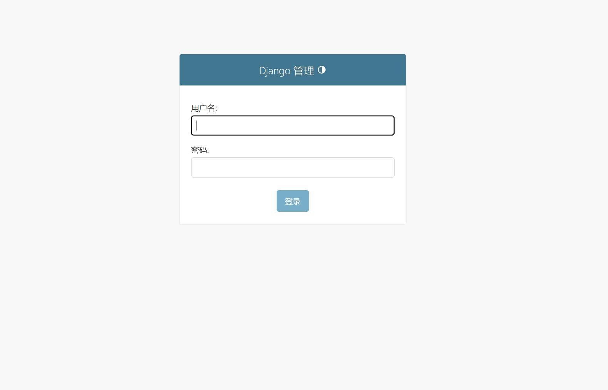
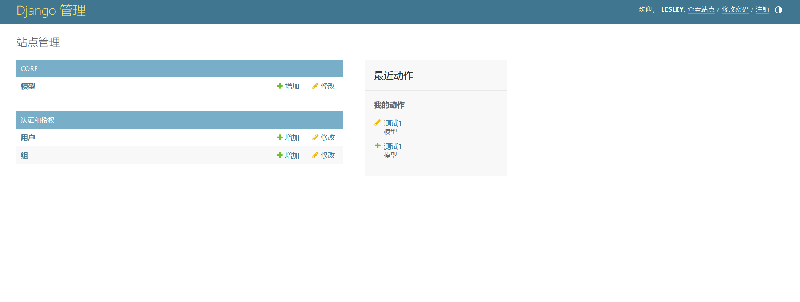
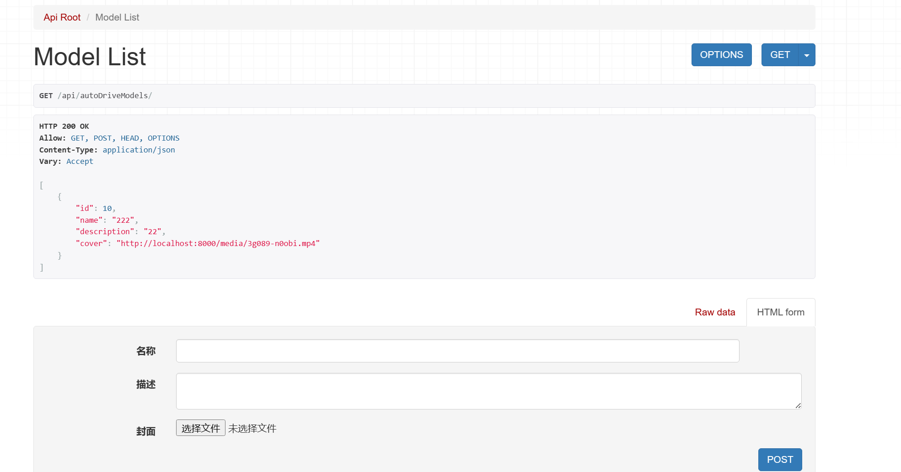
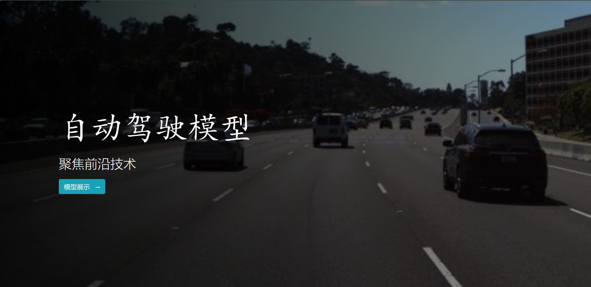
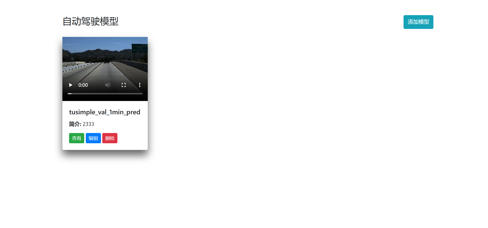
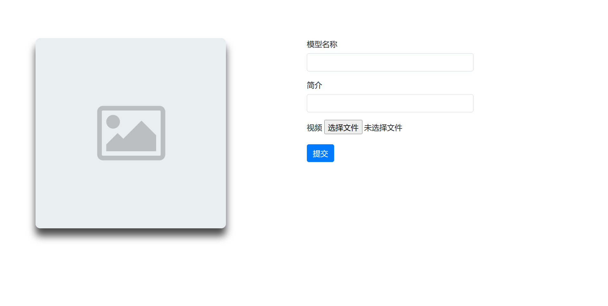
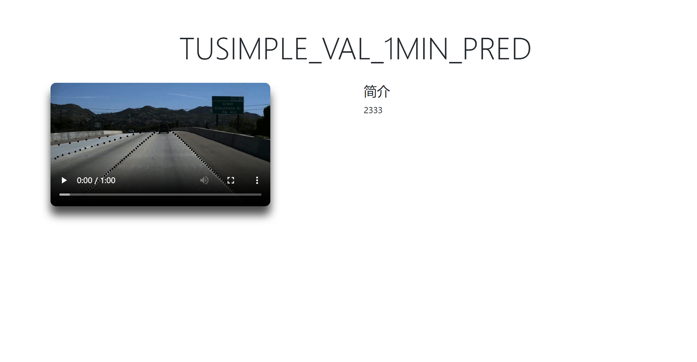
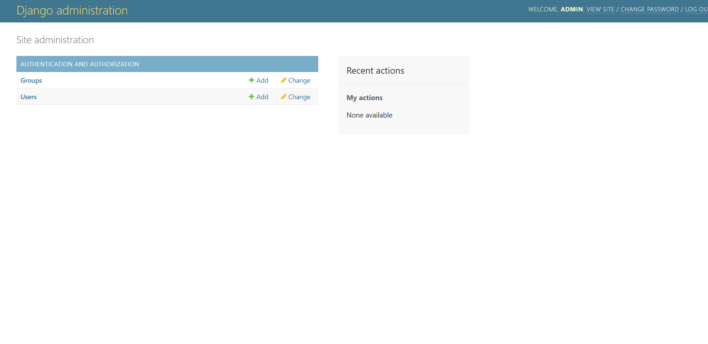
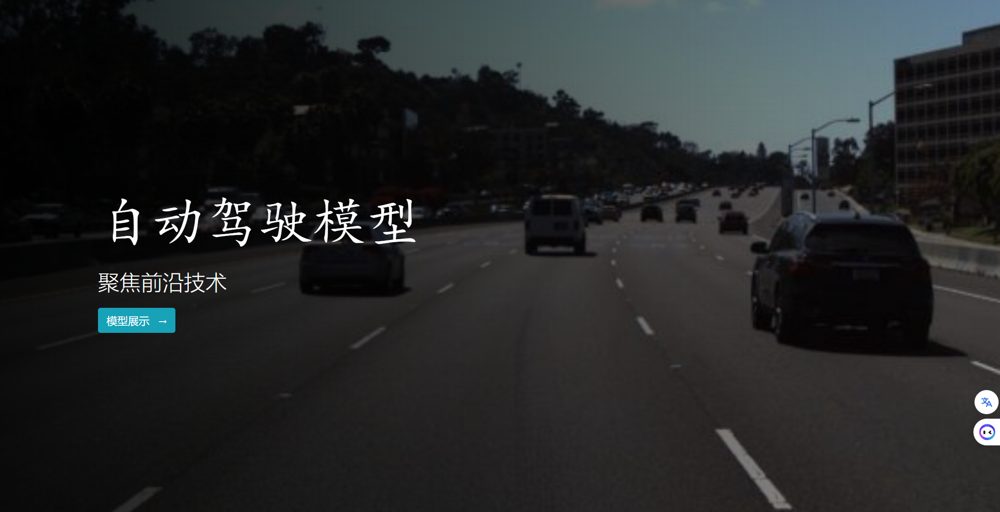

### 后端

进入项目目录`prj`

```python
cd prj
```

创建项目的环境依赖

```python
pip install pipenv
pipenv shell
```

如果看到命令提示符前面出现 `(prj-nV3wuGJ1)` 的提示（后面那串随机字符串可能不一样），就表明我们已经成功地创建了项目独有的虚拟环境。

接着安装 Django “三件套”

- **Django**: Django 框架本身，提供了丰富且强大的服务器开发组件；
- **DRF (Django Rest Framework)**：Django 框架的超级搭档，大大方便了 REST API 的开发；
- **Django CORS Headers**：用于实现跨域资源请求（CORS）的 Django 中间件

```python
(prj-nV3wuGJ1) $ pipenv install django django-rest-framework django-cors-headers
```

运行后端开发服务器

```python
(prj-nV3wuGJ1) $ python manage.py runserver
```

访问 [http://localhost:8000/admin](https://link.zhihu.com/?target=http%3A//localhost%3A8000/admin)，可以看到后台管理的登录页面。

用户名是`lesley`，密码是`abcd8864`





用浏览器访问 http://localhost:8000/api/autoDriveModels，就进入 API 测试页面：

可以通过后台增删改文件



### 前端

进入`client`目录，运行前端网页

```python
cd client
npm run dev
```

访问http://localhost:3000



进入模型展示页面



右上角可添加模型



点击`查看`可访问模型的详情信息




### 后端

进入项目目录`prj`

```python
$ cd prj
```

创建项目的环境依赖

```python
$ pip install pipenv
$ pipenv shell
```

如果看到命令提示符前面出现 `(test-nV3wuGJ1)` 的提示（后面那串随机字符串可能不一样），就表明我们已经成功地创建了项目独有的虚拟环境。

接着安装 Django “三件套”

- **Django**: Django 框架本身，提供了丰富且强大的服务器开发组件；
- **DRF (Django Rest Framework)**：Django 框架的超级搭档，大大方便了 REST API 的开发；
- **Django CORS Headers**：用于实现跨域资源请求（CORS）的 Django 中间件

```python
$ pipenv install django django-rest-framework django-cors-headers
```

创建服务器项目`api`的基本结构，并进入`api`创建一个子应用`core`

```python
$ django-admin startproject api
$ cd api
$ python manage.py startapp core
```

进行数据库迁移，并创建用于登陆后台管理的超级用户

```python
$ python manage.py migrate
$ python manage.py createsuperuser
```

访问localhost:8000/admin，，并输入刚创建的用户名与密码，即可进入后台管理系统



**定义数据模型，用于实现和数据库之间的绑定**

```python
# 在Django模型中，每个模型类对应数据库中的一张表
# Create your models here.
class autoDriveModel(models.Model):
    name=models.CharField(max_length=120,verbose_name='名称')
    description=models.TextField(max_length=400,verbose_name='描述')
    cover=models.FileField(verbose_name='视频')
    

    class Meta: # 定义了autoDriveModel的元数据
        verbose_name = "模型" # 单数形式
        verbose_name_plural = "模型" # 复数形式

    def __str__(self): # 定义了一个对象转化为字符串时应该怎样显示
        return self.name
```

**定义后台管理配置，用于在后台管理系统中进行操作**

```python
# Register your models here.
# 为core子应用配置相应的后台管理功能
admin.site.register(autoDriveModel) # 注册定义好的模型
```

定义序列化器，用于提供数据模型的JSON序列化

```python
# 序列化器是Django Rest Framework提供的功能，能够
# 方便地将Django数据模型序列化成相应的JSON数据格式


class modelSerializer(serializers.ModelSerializer):
    class Meta:
        model=autoDriveModel # 指定模型
        fields=( # 选择相应的字段展示
            'id',
            'name',
            'description',
            'cover'
        )
```

**定义视图，用于实现具体的业务逻辑**

```python
# Create your views here.
# 自定义模型的添加、删除、查询和修改
class modelViewSet(viewsets.ModelViewSet):
    serializer_class=modelSerializer
    queryset=autoDriveModel.objects.all()
```

**定义路由规则，将其映射到相应的视图**

```python
# router 自动生成路由
# /autoDrive/：创建POST/GET
# 

router=DefaultRouter()
router.register(r'autoDriveModels',modelViewSet)

urlpatterns = [
    path('',include(router.urls)),
]

```

**将 `core` 子应用中的路由接入全局路由**

```python
urlpatterns = [
    path('admin/', admin.site.urls),
    path('api/',include('core.urls')),
]+static(settings.MEDIA_URL,document_root=settings.MEDIA_ROOT)

```

**由于数据模型改动，需要重新运行数据库**

```shell
$ python manage.py makemigrations
$ python manage.py migrate
```

### 前端

**创建前端应用**

```shell
$ npx create-nuxt-app client
```

- assets：存放图片、CSS、JS 等原始资源文件
- components：存放 Vue 组件
- layouts：存放应用布局文件，布局可在多个页面中使用
- pages：应用的视图和路由。Nuxt 会根据此目录中的 `.vue` 文件自动创建应用的路由
- static：存放通常不会改变的静态文件，并且将直接映射到路由（即可通过 `/static/picture.png` 访问）

**在client/pages中创建`index.vue`文件，实现前端首页**

通过下面的命令运行前端页面

```shell
npm run dev
```



**数据展示，实现`autoDriveModelCard`组件**

在实现第二个页面之前，我们有必要先了解一下 Nuxt 的路由功能——通过 pages 目录下的文档结构，就可以自动生成 vue-router 的路由器配置！

例如我们这样安排 pages 下面的目录结构 ：

```text
pages
├── README.md
├── index.vue
└── autoDriveModels
    ├── _id
    │   ├── edit.vue
    │   └── index.vue
    ├── add.vue
    └── index.vue
```

`_id` 目录（或者其他以单下划线开头的目录或 .vue 文件）被称作是**动态路由**（Dynamic Routing），可以接受参数作为 URL 的一部分。上面的 pages 目录自动生成下面的 `router`：

```js
router: {
  routes: [
    {
      name: 'index',
      path: '/',
      component: 'pages/index.vue'
    },
    {
      name: 'autoDriveModels',
      path: '/autoDriveModels',
      component: 'pages/autoDriveModels/index.vue'
    },
    {
      name: 'autoDriveModels-add',
      path: '/autoDriveModels/add',
      component: 'pages/recipes/add.vue'
    },
    {
      name: 'autoDriveModels-id',
      path: '/autoDriveModels/:id?',
      component: 'pages/autoDriveModels/_id/index.vue'
    },
    {
      name: 'autoDriveModels-id-edit',
      path: '/autoDriveModels/:id?/edit',
      component: 'pages/autoDriveModels/_id/edit.vue'
    }
  ]
}
```

### 前后端通信

**配置Django的静态文件服务**

配置一下 Django 服务器，使前端能够访问其静态文件。调整 api/api/urls.py 文件如下：

```python
from django.conf import settings
from django.conf.urls.static import static

urlpatterns = [
    path('admin/', admin.site.urls),
    path('api/', include('core.urls')),
] + static(settings.MEDIA_URL, document_root=settings.MEDIA_ROOT)
```
